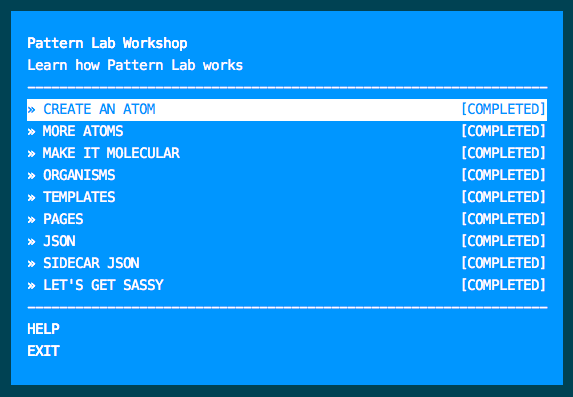

# Pattern Lab Workshopper

This workshopper aims to explain the concepts behind [Pattern Lab](http://patternlab.io/docs/index.html).
Pattern Lab is wicked cool and you should use it! 

## Installation
Once published to npmjs.org, installation will most likely be: `npm install -g pattern-lab-workshop`

### But until then:

`git clone https://github.com/tjheffner/pattern-lab-workshop`

Inside that folder type:

`npm install` 

`npm link` 

Make a new folder somewhere else to run the workshop in.

cd into that new folder and type `pattern-lab-workshop` in the terminal.

## Workshop Commands

`pattern-lab-workshop` to open the menu

`pattern-lab-workshop verify` to test your submission

`pattern-lab-workshop reset` to clear all completed lessons

## API Reference
[Pattern Lab docs](http://patternlab.io/docs/index.html)

[Mustache docs](http://mustache.github.io/mustache.5.html)

[git-it](https://github.com/jlord/git-it) (the workshopper that this was based off of)

[nodeschool](https://nodeschool.io)

## Contributors

[tjheffner](http://github.com/tjheffner)

## License

MIT
